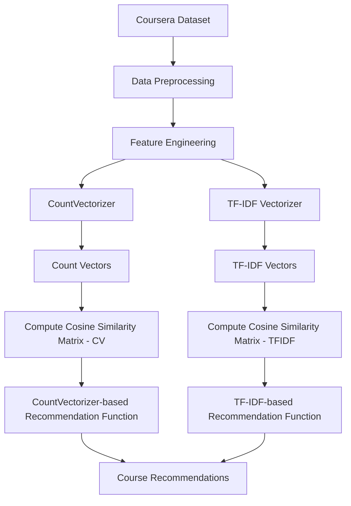
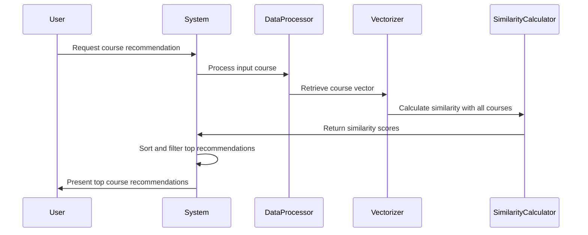

# Course Recommendation System


## 📚 Table of Contents

- [Overview](#overview)
- [Dataset Description](#dataset-description)
- [Implementation Details](#implementation-details)
- [Mathematical Theory](#mathematical-theory)
- [System Architecture](#system-architecture)
- [How to Use](#how-to-use)
- [Results and Evaluation](#results-and-evaluation)
- [Future Improvements](#future-improvements)
- [Requirements](#requirements)
- [Installation](#installation)
- [References](#references)

## Overview

The Course Recommendation System is an intelligent recommendation engine that suggests relevant online courses to users based on content similarity. The system analyzes course descriptions, skills, and other metadata to provide personalized course recommendations from the Coursera platform.

The recommendation algorithm uses Natural Language Processing (NLP) techniques and vector space modeling to compute the similarity between courses. By employing both CountVectorizer and TF-IDF Vectorizer approaches with cosine similarity measurements, the system effectively captures semantic relationships between courses.

## Dataset Description

The implementation uses the "Coursera.csv" dataset which contains a comprehensive collection of 3,522 courses from the Coursera platform. Each course entry includes the following features:

| Feature | Description |
|---------|-------------|
| Course Name | The full title of the course |
| University | The institution offering the course |
| Difficulty Level | Beginner, Intermediate, Advanced, Mixed, or unspecified |
| Course Rating | User rating on a scale (e.g., 4.7, 4.8) |
| Course URL | Direct link to the course on Coursera |
| Course Description | Detailed text description of the course content |
| Skills | Space-separated list of skills taught in the course |

Dataset statistics:
- Total courses: 3,522
- Unique courses: 3,416
- Unique universities/institutions: 184
- Difficulty levels: 5 categories
- Rating range: 31 distinct values
- Most represented university: Coursera Project Network (562 courses)
- Most common difficulty level: Beginner (1,444 courses)
- Most common rating: 4.7 (740 courses)

## Implementation Details

The recommendation system is implemented in Python using a Jupyter notebook environment. The overall workflow includes:

### 1. Data Preprocessing
- Loading the Coursera dataset
- Exploratory data analysis and basic statistics
- Checking for null values (none found)
- Identifying and handling duplicate entries (98 duplicates detected)
- Creating a new dataframe with essential columns
- Converting text data to lowercase to standardize text values
- Creating a 'tags' feature by combining different text features

### 2. Feature Extraction
The system implements two different vectorization techniques:

#### a. Count Vectorization
```python
from sklearn.feature_extraction.text import CountVectorizer
cv = CountVectorizer(max_features=5000, stop_words='english')
vectors_cntv = cv.fit_transform(new_df['tags']).toarray()
```

#### b. TF-IDF Vectorization
```python
from sklearn.feature_extraction.text import TfidfVectorizer
tfidf = TfidfVectorizer(stop_words='english')
vectors_tf = tfidf.fit_transform(new_df['tags']).toarray()
```

### 3. Similarity Calculation
Cosine similarity is used to measure the similarity between course vectors:

```python
from sklearn.metrics.pairwise import cosine_similarity
similarity_cntv = cosine_similarity(vectors_cntv)
similarity_tf = cosine_similarity(vectors_tf)
```

### 4. Recommendation Functions
Two recommendation functions are implemented using different vectorization methods:

#### a. CountVectorizer-based recommendations
```python
def recommend(course):
    course_index = new_df[new_df['course_name'] == course].index[0]
    distances = similarity_cntv[course_index]
    course_list = sorted(list(enumerate(distances)), reverse=True, key=lambda x:x[1])[1:7]

    for i in course_list:
        print(new_df.iloc[i[0]].course_name)
```

#### b. TF-IDF-based recommendations
```python
def recommend_tf(course):
    course_index = new_df[new_df['course_name'] == course].index[0]
    distances = similarity_tf[course_index]
    course_list = sorted(list(enumerate(distances)), reverse=True, key=lambda x:x[1])[1:7]

    for i in course_list:
        print(new_df.iloc[i[0]].course_name)
```

## Mathematical Theory

### Vector Space Model

The recommendation system employs the Vector Space Model (VSM) to represent text documents (course descriptions and skills) as vectors in a high-dimensional space. Each dimension corresponds to a term in the vocabulary.

### 1. CountVectorizer

The CountVectorizer creates a sparse matrix where:
- Each row represents a document (course)
- Each column represents a term in the vocabulary
- Each cell $a_{ij}$ contains the count of term $j$ in document $i$

Mathematically, for a document $d$ and a term $t$:
- $Count(t,d)$ = Number of occurrences of term $t$ in document $d$

### 2. TF-IDF Vectorizer

TF-IDF (Term Frequency-Inverse Document Frequency) measures the importance of a term in a document relative to the entire corpus.

For a term $t$ in document $d$ from a corpus $D$:

#### Term Frequency (TF)
$$TF(t,d) = \frac{\text{Number of times term } t \text{ appears in document } d}{\text{Total number of terms in document } d}$$

#### Inverse Document Frequency (IDF)
$$IDF(t, D) = \log\frac{\text{Total number of documents in corpus}}{\text{Number of documents containing term } t}$$

#### TF-IDF Score
$$TFIDF(t,d,D) = TF(t,d) \times IDF(t,D)$$

### 3. Cosine Similarity

To measure similarity between two course vectors $A$ and $B$, cosine similarity is applied:

$$\text{cosine similarity}(A, B) = \frac{A \cdot B}{||A|| \times ||B||} = \frac{\sum_{i=1}^{n} A_i B_i}{\sqrt{\sum_{i=1}^{n} A_i^2} \times \sqrt{\sum_{i=1}^{n} B_i^2}}$$

Where:
- $A \cdot B$ is the dot product of vectors $A$ and $B$
- $||A||$ and $||B||$ are the Euclidean norms (magnitudes) of vectors $A$ and $B$

Cosine similarity values range from -1 (completely dissimilar) to 1 (exactly similar), with 0 indicating orthogonality (no correlation).

## System Architecture



### Recommendation Process Flow




## How to Use

1. Clone the repository:
```bash
git clone https://github.com/Uttam-Mahata/Course-Recommendation-System.git
cd Course-Recommendation-System
```

2. Install the required dependencies:
```bash
pip install pandas numpy scikit-learn matplotlib seaborn flask
```

3. Run the Flask application:
```bash
python app.py
```

4. Open your web browser and go to `http://127.0.0.1:5000` to access the Course Recommendation System.

5. Enter a course name in the input field and click "Get Recommendations" to see the recommended courses.

## Results and Evaluation

The system provides two recommendation methods:

1. **CountVectorizer-based recommendations**: This approach gives equal weight to all terms and can be more effective when the frequency of terms matters more than their distribution across the corpus.

2. **TF-IDF-based recommendations**: This method works better for identifying unique distinguishing terms across courses, potentially giving better semantic similarity.

Qualitative evaluation shows that both approaches provide relevant recommendations, but TF-IDF tends to capture more nuanced semantic relationships between courses.

